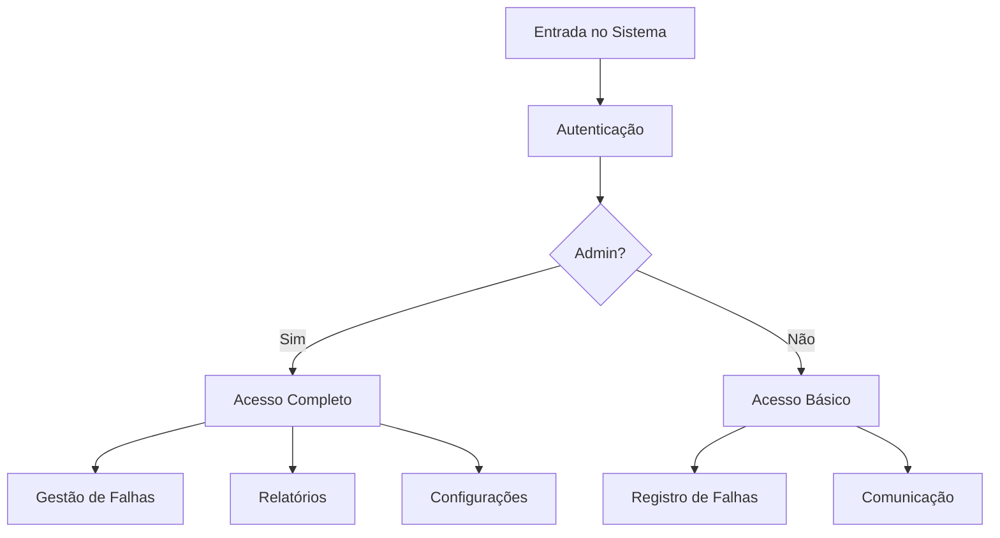

# Blackout Guardian - Sistema Avançado de Resiliência Energética

## 🌐 Visão Geral do Projeto
O **Blackout Guardian** é uma solução inovadora para gestão de crises energéticas, desenvolvida em C# (.NET 6.0+) com arquitetura modular que combina:
- **Monitoramento inteligente** de falhas
- **Comunicação P2P offline** (Bluetooth/Wi-Fi Direct)
- **Sistema de alertas prioritários** com IA básica
- **Plataforma unificada** para usuários e administradores

## 🚀 Funcionalidades Principais

### 🔌 Gestão de Falhas
- Registro automatizado com localização geográfica
- Classificação por severidade (Baixa/Média/Alta)
- Histórico completo com carimbo temporal (dd/MM/yyyy HH:mm:ss)

### 📡 Comunicação Resiliente
- Modo offline com armazenamento local por 72h
- Rede mesh entre dispositivos próximos
- Sincronização automática pós-reconexão

### 🔒 Segurança e Acessos
- Autenticação de dois níveis (Admin/Usuário)
- Criptografia AES-256 para dados sensíveis
- Anonimização em relatórios públicos

## ⚙️ Tecnologias Utilizadas
| Componente        | Tecnologia               | Finalidade                     |
|-------------------|--------------------------|--------------------------------|
| Backend           | .NET 6.0+               | Lógica principal e APIs        |
| Frontend          | Console Application      | Interface administrativa       |
| Mobile            | React Native (futuro)    | Acesso remoto                  |
| Persistência      | System.Text.Json         | Armazenamento em JSON          |
| Comunicação       | Bluetooth/Wi-Fi Direct   | Rede P2P offline               |

Estrutura do Projeto


## 🛠️ Instalação e Execução

### Pré-requisitos
- [.NET 6.0 SDK](https://dotnet.microsoft.com/download) ou superior
- IDE recomendada:
  - Visual Studio 2022+ (Windows)
  - VS Code com extensão C# (multiplataforma)

### Passo a Passo
```bash
# Clone o repositório
git clone https://github.com/seu-usuario/BlackoutGuardian.git

# Acesse o diretório
cd BlackoutGuardian/BlackoutGuardianConsole

# Execute o projeto
dotnet run
```

## 🔐 Credenciais de Teste
| Tipo de Usuário  | Login      | Senha     |
|------------------|------------|-----------|
| Administrador    | RM550360   | 090603    |
| Usuário Comum    | user       | user123   |

## 📊 Estrutura de Dados


## 📦 Principais Arquivos
- `falhas.json`: Registro estruturado de incidentes
- `alertas.json`: Histórico de notificações prioritárias
- `mensagens_offline.json`: Comunicação P2P armazenada
- `logs.txt`: Auditoria do sistema

## 🔮 Roadmap (Próximas Versões)
1. Integração com sensores IoT (temperatura/umidade)
2. Dashboard web para monitoramento em tempo real
3. Módulo de simulação de crises no Unreal Engine
4. Implementação de blockchain para logs imutáveis

## 👥 Equipe de Desenvolvimento
| Membro                      | RM      | Função Principal           |
|-----------------------------|---------|----------------------------|
| Anna Heloisa Soto Yagyu     | 550360  | Arquitetura de Segurança   |
| Breno da Silva Santos       | 99275   | Backend .NET               |
| Gustavo Kawamura Christofani| 99679   | Integração P2P             |

## 📄 Licença
Projeto acadêmico desenvolvido para fins educacionais - © 2025
